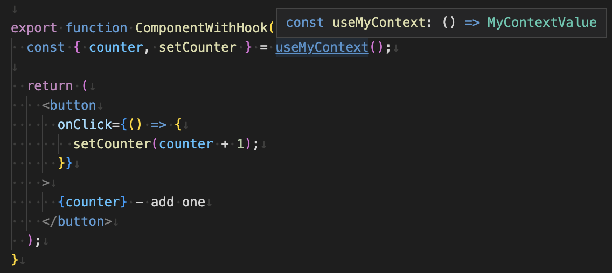

# create-use-context

A helper method which wraps original React `createContext` method and type-safe `useContext` hook which will throw if used outside of `Provider`.

## Installation

Using NPM:

```sh
npm install create-use-context
```

Using Yarn:

```sh
yarn add create-use-context
```

## Screenshot

Mind the `useMyContext` return type is `NonNullable` context value. It will throw if used outside of `Provider`



## Usage

```tsx
import React, { createContext, useState, FC, Dispatch, SetStateAction } from 'react';
import { createUseContext } from 'create-use-context';

type Counter = number;

const INITIAL_COUNT: Counter = 0;

export interface MyContextValue {
  counter: Counter;
  setCounter: Dispatch<SetStateAction<Counter>>;
}

export const MyContext = createContext<MyContextValue | null>(null);

MyContext.displayName = 'MyContext';

export const MyContextProvider: FC = ({ children }) => {
  const [counter, setCounter] = useState(INITIAL_COUNT);

  return (
    <MyContext.Provider value={{ counter, setCounter }}>
      {children}
    </MyContext.Provider>
  );
};

export const useMyContext = createUseContext(MyContext);

export function ComponentWithHook() {
  const { counter, setCounter } = useMyContext();

  return (
    <button
      onClick={() => {
        setCounter(counter + 1);
      }}
    >
      {counter} - add one
    </button>
  );
}

export function App() {
  return (
    <MyContextProvider>
      <ComponentWithHook />
    </MyContextProvider>
  );
}
```
